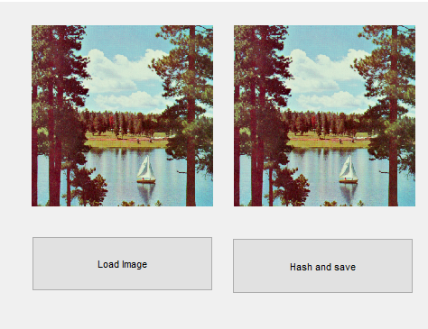
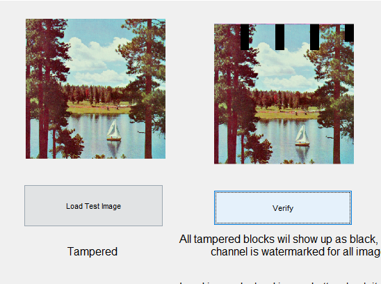
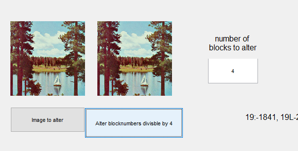

# A Novel Hash Function-based Fragile Watermarking Method for Image Integrity 

## Implementation of the [paper](https://link.springer.com/article/10.1007/s11042-018-7084-0) for a university project

### Group Members

- 19L-1841 Muhammad Asad Bin Hameed
- 19L-2413 Syed Junaid Qutab

### Working

- Load up the ``sha256Watermarking.m`` file in matlab and run

- Load an image and click hash and save to save it with the watermark
- Save it in a lossless compression format to keep the watermark

- Load the saved image and click verify to test if the image has been tampered with or not

- Tampered parts will show up in black

- You can also modify the image by using the bottom two axes
- Load the image
- Specify the modification / number of blocks to alter
- Modify

